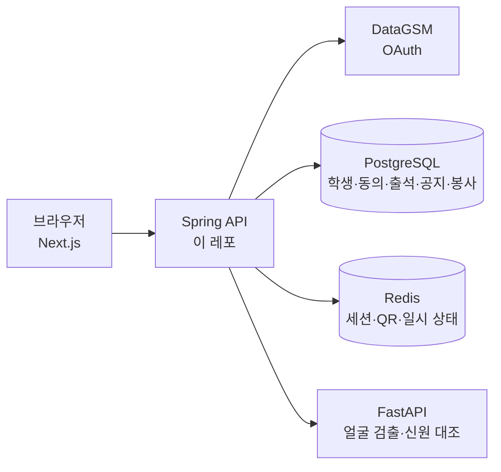

<h1 align="center">CheckUp Server</h1>

<p align="center">
  광주소프트웨어마이스터고등학교 기숙사 출석 관리 서비스 <b>CheckUp</b>의 Spring Boot 백엔드
</p>

<p align="center">
  <a href="https://github.com/Start-Up-10th/CheckUp-server/actions/workflows/ci.yml"></a>
  
  
  
  
</p>

<p align="center">
  <a href="#소개">소개</a> ·
  <a href="#빠른-시작">빠른 시작</a> ·
  <a href="#설정">설정</a> ·
  <a href="#개발-도구">개발 도구</a> ·
  <a href="#얼굴-ai-서비스-연결">얼굴 AI 연결</a> ·
  <a href="#명세문서">명세·문서</a>
</p>

---

## 소개

기숙사 자치위원이 학생을 한 명씩 확인하던 입소·자습실 출석을 **얼굴 인식**과 **QR 인증**으로 대신합니다.
기숙사생 약 200명, 출입구 3곳을 대상으로 하며 학생과 관리자 모두 웹으로 사용합니다.

> 기능별 구현 상태는 `docs-harness/docs/plans/`를 확인하세요. 얼굴 AI의 현재 연결 상태와 남은 검증은 `face-recognition.md`에 기록합니다.

## 서버가 맡는 일

| 영역 | 내용 |
| --- | --- |
| 인증·권한 | DataGSM OAuth 로그인, 개인정보 동의, 관리자·본인·본인 호실 범위를 서버에서 검증 |
| 출석 | 얼굴 인식·QR 결과를 받아 학생·용도(기숙사 입소 / 자습실)·운영일 단위로 출석 확정, 중복 방지, 관리자 수동 수정 |
| QR 세션 | 관리자 페이지별 독립 세션과 15분마다 교체되는 토큰 |
| 운영일 | 매일 08:00(KST) 기준 당일 기록 정리 |
| 공지·봉사 | 공지와 학생 알림, 봉사 횟수 관리 |

얼굴 검출·임베딩 대조는 FastAPI(AI 서버)가 맡고, **출석 확정은 이 서버가 합니다.**

## 아키텍처



## 기술 스택

| 구분 | 사용 기술 |
| --- | --- |
| 언어·프레임워크 | Java 25, Spring Boot 4.1 |
| 웹·보안 | Spring Web MVC, Spring Security (OAuth2 Client) |
| 데이터 | Spring Data JPA, Spring Data Redis, PostgreSQL 17, Redis 7, Flyway |
| 테스트 | JUnit 5 |
| CI | GitHub Actions |

## 빠른 시작

### 1. 저장소 받기

```bash
git clone --recurse-submodules https://github.com/Start-Up-10th/CheckUp-server.git

# 이미 clone했다면
git submodule update --init
```

`docs-harness/`가 비어 있다면 서브모듈을 받지 않은 상태입니다. 위 명령을 실행하세요.

### 2. 로컬 DB 띄우기

서버 실행과 테스트 모두 Postgres·Redis가 필요합니다. `compose.yaml`로 띄웁니다.

```bash
docker compose up -d
```

`application.yaml`의 기본값이 `compose.yaml`과 맞춰져 있어 별도 설정 없이 접속됩니다.

### 3. 개인 설정 넣기

`src/main/resources/application-local.yaml`을 만들어 값을 넣습니다.
이 파일은 커밋되지 않습니다. OAuth Secret 같은 비밀값도 여기에 둡니다.

로컬에서도 기본값이 없는 값은 반드시 넣어야 서버와 테스트가 뜹니다.

```yaml
datagsm:
  client-id: local-test
  client-secret: local-test
checkup:
  web:
    base-url: http://localhost:3000
  qr:
    base-url: http://localhost:3000
```

기본값을 바꾸고 싶을 때도 같은 파일에서 덮어씁니다.

```yaml
spring:
  datasource:
    url: jdbc:postgresql://localhost:5432/checkup
```

### 4. 빌드·테스트·실행

Java 25가 필요하고, 로컬 DB가 떠 있어야 합니다.

```bash
./gradlew build
./gradlew bootRun
```

서버가 뜨면 API 문서를 http://localhost:8080/swagger-ui/index.html 에서 볼 수 있습니다.

## 프로젝트 구조

```text
src/main/java/com/checkup/checkup
├── domain
│   ├── attendance      출석 저장·조회
│   ├── auth            DataGSM OAuth 로그인·세션
│   ├── consent         개인정보 동의
│   ├── face            얼굴 등록·인식 세션, AI 서버 연동
│   ├── member          회원·학생
│   ├── notification    학생 알림
│   ├── qr              QR 세션·스캔 출석
│   ├── room            호실 명단·전개도 출석
│   ├── user            학생 정보·봉사 내역 조회
│   ├── volunteer       봉사 횟수
│   └── webhook         DataGSM 웹훅·학생 동기화
└── global
    ├── config          공통 설정
    ├── exception       오류 코드·응답
    ├── querylog        요청별 쿼리 수 로그
    ├── ratelimit       요청 횟수 제한
    ├── security        Spring Security·출처 확인
    └── time            Clock·운영일 계산
```

## 설정

운영 서버에서는 환경변수로 값을 넣습니다. 항목과 설명은 `.env.example`에도 있습니다.

### 주요 환경변수

| 환경변수 | 기본값 | 설명 |
| --- | --- | --- |
| `DB_URL`, `DB_USERNAME`, `DB_PASSWORD` | 로컬 `compose.yaml` 값 | PostgreSQL 접속 정보 |
| `REDIS_HOST`, `REDIS_PORT` | `localhost`, `6379` | Redis 접속 정보 |
| `PUBLIC_ORIGIN` | 없음(필수) | 웹 주소. QR 링크와 로그인 후 웹으로 돌아가는 주소에 쓰이며, 비어 있으면 서버가 기동하지 않습니다 |
| `DATAGSM_CONNECT_TIMEOUT`, `DATAGSM_RESPONSE_TIMEOUT` | `3s`, `5s` | DataGSM 호출 대기 시간. 시간 안에 응답이 없으면 `DATAGSM_UNAVAILABLE`로 응답합니다 |
| `DB_POOL_SIZE`, `DB_POOL_TIMEOUT_MS` | `10`, `10000` | DB 커넥션 풀 크기와, 풀이 가득 찼을 때 실패하기까지 기다리는 시간 |
| `SESSION_TIMEOUT` | `7d` | 요청이 없을 때 로그인 세션 유지 시간 |
| `SESSION_COOKIE_SECURE` | `false` | HTTPS에서만 세션 쿠키 전송. 운영에서는 `true` |
| `SWAGGER_ENABLED` | `true` | API 문서 공개 여부 |
| `SHUTDOWN_TIMEOUT` | `30s` | 종료 신호 뒤 처리 중인 요청을 기다리는 시간 |
| `SHUTDOWN_GRACE_PERIOD` | `45s` | docker가 컨테이너를 강제 종료하기까지의 시간 |
| `SERVER_JAVA_OPTS` | `-XX:+ExitOnOutOfMemoryError` | 서버 JVM 옵션 |
| `QUERY_LOG_ENABLED` | `false` | 요청별 DB 쿼리 수·걸린 시간 로그 ([개발 도구](#개발-도구)) |
| `METRICS_ENABLED` | `false` | Prometheus 지표 내보내기. 로컬 전용 ([개발 도구](#개발-도구)) |

얼굴 AI 관련 값은 [얼굴 AI 서비스 연결](#얼굴-ai-서비스-연결)을 보세요.

### 운영 시 알아 둘 점

- **로그인 콜백**: 성공하면 `{PUBLIC_ORIGIN}/login/complete`(또는 `GET /api/v1/auth/login?redirect=/경로`로 정한 경로), 실패하면 `{PUBLIC_ORIGIN}/login?error=<오류 코드>`로 302 리다이렉트합니다.
- **DB 커넥션 풀**: 서버 대수 × 풀 크기는 Postgres `max_connections`보다 작아야 합니다.
- **종료**: 재시작·배포 때 종료 신호를 받으면 새 요청을 받지 않고 처리 중인 요청을 `SHUTDOWN_TIMEOUT`까지 마친 뒤 종료합니다. docker는 `SHUTDOWN_GRACE_PERIOD`가 지나면 강제 종료하므로 이 값이 더 커야 합니다. 서버가 한 대라 배포 중 잠깐의 중단은 남습니다.
- **메모리**: 서버 JVM은 `OutOfMemoryError`가 나면 종료하고 컨테이너 restart 정책이 다시 띄웁니다. 힙 크기와 컨테이너 메모리 제한은 운영 VM 메모리를 확인하기 전까지 정하지 않아 JVM 기본값(호스트 메모리의 25%)입니다.
- **Redis**: 운영 Redis는 `maxmemory-policy noeviction`으로 설정합니다. 로그인 세션·QR 세션·QR 토큰 기록이 Redis에 있어, 메모리가 부족할 때 키를 먼저 지우는 정책(`allkeys-lru` 등)이면 로그인이 풀리거나 만료된 QR이 `INVALID`로 잘못 안내됩니다.

## 개발 도구

성능을 고치기 전후를 비교할 때 쓰는 도구입니다.

| 도구 | 켜는 방법 | 알 수 있는 것 |
| --- | --- | --- |
| [쿼리 수 로그](#쿼리-수-로그) | `QUERY_LOG_ENABLED=true` | 요청 하나의 DB 쿼리 수와 걸린 시간 |
| [부하 기준값 측정](#부하-기준값-측정-로컬-전용) | `LOADTEST=true` | 동시 호출 시 응답 시간과 호출당 쿼리 수 |
| [지표 대시보드](#지표-대시보드-로컬-전용) | `METRICS_ENABLED=true` | 시간에 따른 응답 시간·쿼리 수·연결 풀·메모리 |

### 쿼리 수 로그

요청마다 응답 상태, DB 쿼리 수, 걸린 시간을 로그 한 줄로 남깁니다. 기본은 꺼져 있습니다.

```bash
QUERY_LOG_ENABLED=true ./gradlew bootRun
```

```text
GET /api/v1/room/floor status=200 queries=2 elapsedMs=14
```

경로만 남기고 쿼리 문자열·헤더·본문은 남기지 않습니다. `/actuator` 아래 요청은 남기지 않습니다.

### 부하 기준값 측정 (로컬 전용)

출석 시간대에 몰리는 요청(QR 스캔 폭주, 학생 홈 조회, 관리자 호실·층 조회)을 서비스 계층에서 동시에 호출해 응답 시간과 호출당 DB 쿼리 수를 잽니다. 로컬 Postgres·Redis(`docker compose up -d postgres redis`)가 필요하고, 학생 200명을 임시로 만들었다 지웁니다.

```bash
LOADTEST=true ./gradlew test --rerun --tests "*ServiceLoadTest"
# 결과: build/loadtest/report.md (동시 호출 수는 LOADTEST_CONCURRENCY, 기본 50)
```

- 평소 `./gradlew build`에서는 `LOADTEST`가 없어 건너뜁니다.
- HTTP·로그인·직렬화와 DataGSM·얼굴 AI 호출은 포함하지 않습니다. 절대값이 아니라 변경 전후 비교와 호출당 쿼리 수를 보는 용도입니다.
- 실행마다 20% 안팎 흔들리니 같은 조건에서 두세 번 돌려 비교하세요.

### 지표 대시보드 (로컬 전용)

API별 응답 시간, DB 쿼리 수, DB 연결 풀, JVM 메모리를 Grafana로 볼 수 있습니다. 운영에는 적용하지 않았습니다.

```bash
docker compose --profile metrics up -d
METRICS_ENABLED=true ./gradlew bootRun
```

| 주소 | 용도 |
| --- | --- |
| http://localhost:3001 | Grafana. 로그인 없이 보기 전용이며 `CheckUp 서버` 대시보드가 바로 열립니다 |
| http://localhost:9090 | Prometheus. `Status > Target health`에서 서버가 `UP`인지 확인합니다 |

- `METRICS_ENABLED=true`이면 `/actuator/prometheus`가 로그인 없이 열립니다. 기본은 꺼져 있고 그때는 경로 자체가 없습니다.
- `docker compose up -d`만 실행하면 Prometheus와 Grafana는 뜨지 않습니다.
- 대시보드는 `monitoring/grafana/dashboards/checkup-server.json`, 수집 설정은 `monitoring/prometheus.yml`입니다.
- 끌 때는 `docker compose --profile metrics stop prometheus grafana`입니다.

## 얼굴 AI 서비스 연결

Spring은 얼굴 등록·프레임 추론 요청을 AI 서비스에 위임하고 브라우저는 Spring API만 호출합니다. 로컬에서는 `application-local.yaml`, 운영에서는 Spring 프로세스 환경변수로 설정합니다.

```yaml
checkup:
  face:
    ai-base-url: ${FACE_AI_BASE_URL:http://host.docker.internal:8000/}
    service-token: ${FACE_SERVICE_TOKEN}
```

| 환경변수 | 설명 |
| --- | --- |
| `FACE_AI_BASE_URL` | AI 서비스 origin. Spring이 `/health/ready`와 `/internal/v1/face/*` 경로를 붙입니다 |
| `FACE_SERVICE_TOKEN` | AI와 Spring에 동일하게 설정하는 서버 간 secret. 브라우저에 보내지 않습니다 |

- **주소 형식**: readiness 주소가 `http://service.gsmsv.site:32200/health/ready`라면 base URL은 `http://service.gsmsv.site:32200`입니다. 끝의 `/`는 Spring에서 제거합니다.
- **컨테이너에서 연결**: Spring 컨테이너에서 호스트의 8000번 포트로 노출된 AI에 연결할 때 기본값 `http://host.docker.internal:8000/`을 사용합니다. Linux Docker에서는 Spring 컨테이너에 `host.docker.internal:host-gateway` 매핑이 필요할 수 있습니다.
- **호스트에서 직접 실행**: `FACE_AI_BASE_URL=http://localhost:8000`으로 지정할 수 있습니다.
- **토큰 보호**: 토큰이 포함된 요청은 HTTPS 또는 신뢰된 사설망으로만 전송하고 AI 포트의 접근을 Spring 서버로 제한합니다.
- **AI 인스턴스 수**: AI 인식 세션은 프로세스 메모리에 저장되므로 AI 인스턴스 하나를 사용하거나 `session_id` 기준으로 같은 인스턴스에 라우팅해야 합니다.

### 배포 AI 연결 확인

배포 AI의 인증 경로 스모크 테스트는 기본 테스트에서 실행되지 않습니다. HTTPS 또는 신뢰된 사설망에서만 실제 설정값으로 옵트인합니다.

```powershell
$env:FACE_AI_BASE_URL = 'https://<private-ai-host>'
$env:FACE_SERVICE_TOKEN = '<same secret configured on AI>'
$env:FACE_AI_LIVE_TESTS = 'true'
.\gradlew.bat test --tests com.checkup.checkup.domain.face.ai.AiFaceClientLiveIntegrationTest
```

이 검사는 readiness와 임의 세션 ID의 멱등 삭제를 호출하고 얼굴 영상·벡터를 전송하지 않습니다. 사설망 HTTP가 꼭 필요할 때만 `FACE_AI_LIVE_ALLOW_HTTP=true`를 사용합니다.

## 명세·문서

공통 명세·지침·스킬은 [Start-Up-harness](https://github.com/Start-Up-10th/Start-Up-harness)에 있으며, 이 레포에는 `docs-harness/` 서브모듈로 연결되어 있습니다.

| 문서 | 위치 |
| --- | --- |
| 제품 명세 | `docs-harness/docs/spec/` |
| 아키텍처·기술 결정 | `docs-harness/docs/architecture.md`, `docs-harness/docs/decisions.md` |
| 백엔드 작업 지침 | `docs-harness/server/AGENTS.md` |

명세·계획·API 계약 수정은 이 레포가 아니라 Start-Up-harness 레포에서 커밋합니다.

### 하네스 최신화

서브모듈은 기록된 커밋에 고정되어 있어 자동으로 최신이 되지 않습니다.

```bash
git submodule update --remote docs-harness
git add docs-harness
git commit -m "chore: 하네스 최신화"
```

## 브랜치

- 기능 PR은 `develop`으로 보냅니다. approve 1개와 CI 통과가 필요합니다.
- `main`은 배포할 때만 `develop`에서 머지합니다.
